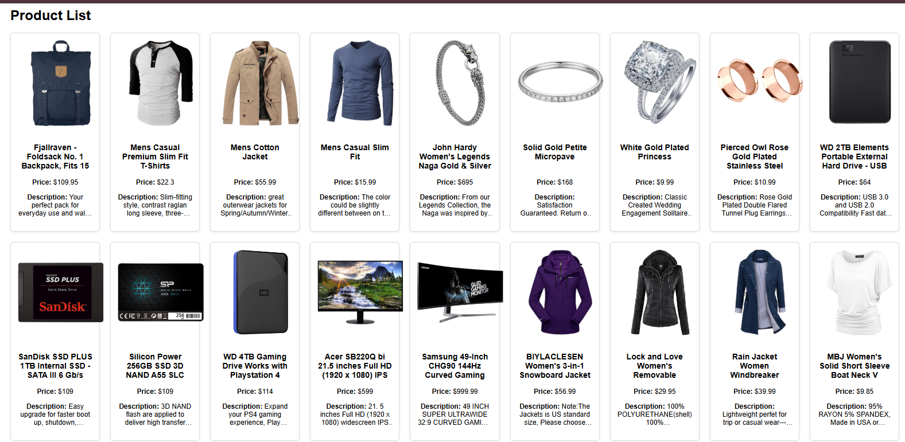

# React Product List App

A simple React application that fetches product data from the FakeStore API using Axios and displays it in a responsive grid layout.

## 🚀 Features
- Fetch API data using Axios
- Async/Await implementation
- Loading state handling
- Error handling
- Responsive grid layout
- Clean UI design

## 🛠 Tech Stack
- React
- Axios
- Vite
- JavaScript (ES6)

## 📦 Installation

1. Clone the repository
```bash
 https://github.com/ifra489/react-product-list-app.git
```
2. Navigate into the project
```
cd vite-project
 ```

3.Install dependencies
```
npm install
```

4. Run the development server

```
npm run dev

```

## Screenshot


## 🌐 API Used
FakeStore API  
https://fakestoreapi.com/products
